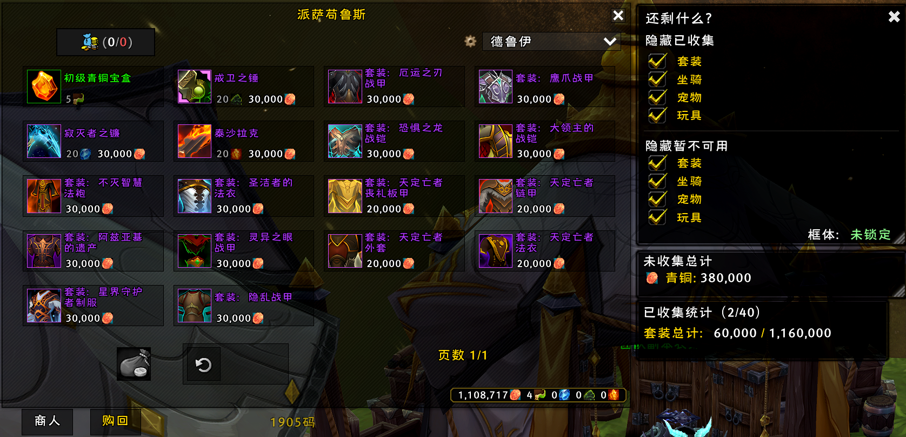
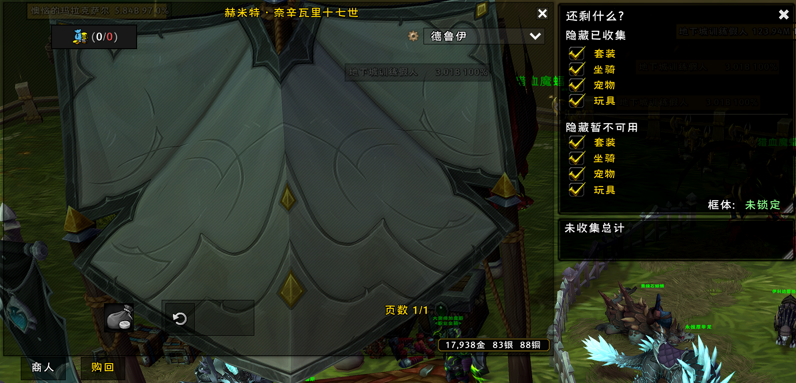
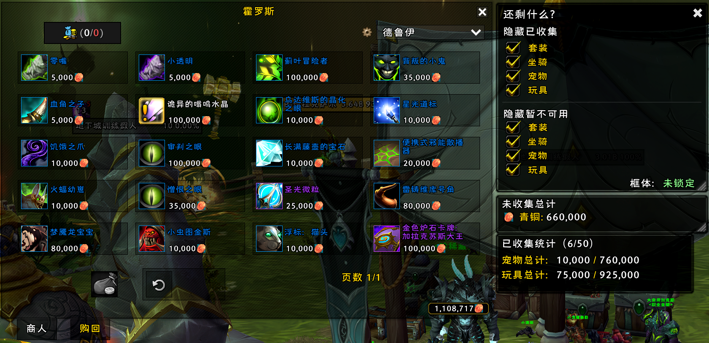
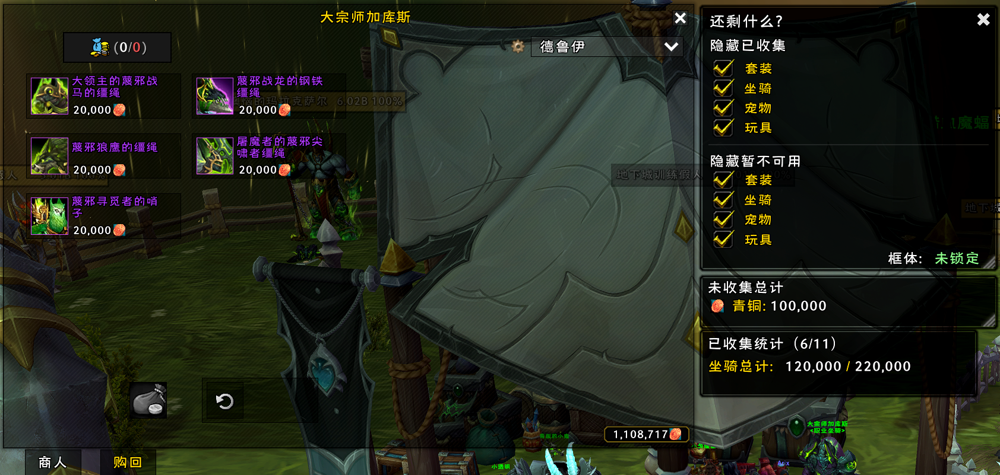

# What's Left? (还剩什么?) - 中文说明

## 插件简介

**What's Left?** 是一个轻量级的魔兽世界插件，专为 Legion Remix（军团幻彩）设计。它能够帮助玩家轻松过滤供应商和收藏标签页，隐藏已经学过的物品、坐骑、宠物、外观和玩具，让你专注于还缺少的收藏品。

## 核心功能

- **隐藏分类**：无论是坐骑、玩具、宠物还是外观，你可以灵活切换选择想要或不想看到的内容。（隐藏当前无法获得的物品也会实时更新所需的青铜成本）

- **未学习总计**：快速计算完成供应商所有物品需要多少青铜。

- **详细统计**：查看已学习与未学习物品的清晰对比，以及总青铜成本，帮助你一眼追踪进度和消费情况。（点击"未学习总计"中的青铜图标即可显示统计容器）

- **超轻量级**：为速度而生，代码少，清晰度高。

- **军团幻彩就绪**：专为军团幻彩供应商设计，简单即插即用，兼容默认UI、ElvUI和大多数自定义皮肤。

## 使用方法

1. 打开任何出售坐骑、宠物、玩具或外观的供应商。
2. 点击默认供应商过滤器左侧的齿轮图标
3. 使用侧边面板的切换按钮隐藏你已经收集的任何物品。
4. 将鼠标悬停在详细统计部分以查看你的已学习与未学习总计。
5. 就这样，简单、快速、开箱即用。

## 斜杠命令

- `/wl` - 如果齿轮图标没有出现，打开过滤菜单
- `/wlreset` - 重置所有启用的过滤器

## 多语言支持

当前版本包含了**简体中文**和**繁体中文**的翻译。根据梳理好的架构设计，只需在代码开头的 `WL_LOCALES` 中增加相应的翻译文字，即可轻松支持更多国家和地区的语言。

## 截图展示

### 团本套装售卖商人

### 坐骑售卖商人

### 玩具宠物售卖商人

### 职业坐骑售卖商人

## 兼容性

- 支持 World of Warcraft Legion Remix（军团幻彩）

## 贡献

所有的贡献归于原作者：Discord: Gunner.4

## 许可证

请参阅原插件的许可证信息。

---

**原插件地址**: https://www.curseforge.com/wow/addons/whats-left
